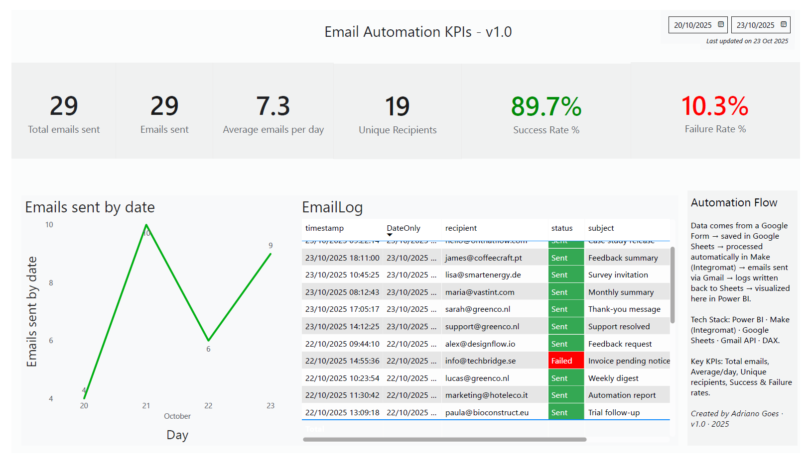

# Email Automation KPIs - v1.0

## Summary

This project demonstrates an end-to-end automation workflow that connects Google Forms, Google Sheets, Make (Integromat), Gmail, and Power BI.

- Google Form captures new lead submissions.  
- Google Sheets stores form responses in real time.  
- Make watches for new rows, automatically sends personalized emails via Gmail, and writes success or error logs into an **Automation_Log** sheet.  
- Power BI visualizes the log data to monitor automation performance and email success metrics.

---

## Workflow Overview

**1. Google Form → Google Sheets**  
Every new form submission is stored automatically in a Google Sheet (`Leads_DB`).

**2. Make (Integromat) Automation**  
- Watches the `Leads_DB` sheet for new rows.  
- Sends an email using Gmail with personalized content (e.g., “Thanks for reaching out, {First Name}”).  
- Logs the result of each email (Sent or Failed) into a second sheet, `Automation_Log`.  
- In case of failure, captures the detailed error message (SMTP Error, Invalid Recipient, Quota Exceeded, etc.).

**3. Power BI Dashboard**  
- Connects directly to the `Automation_Log` sheet.  
- Automatically updates visual KPIs at each refresh.

---

## Tech Stack

- **Google Forms** – data collection interface.  
- **Google Sheets** – storage and log management.  
- **Make (Integromat)** – workflow automation (trigger → send email → write log).  
- **Gmail API** – email delivery and error reporting.  
- **Power BI** – reporting and performance visualization.  
- **DAX** – custom measures for KPIs.

---

## Power BI Dashboard

The Power BI report visualizes all logs and metrics from the automation process.

### Main KPIs

| KPI | Description | Formula (DAX) |
|-----|--------------|---------------|
| **Total Emails Sent** | Counts all email operations (Sent + Failed). | `COUNTROWS(EmailLog)` |
| **Emails Sent (Successful)** | Number of successfully sent emails. | `CALCULATE(COUNTROWS(EmailLog), EmailLog[status] = "Sent")` |
| **Success Rate %** | Percentage of successful sends. | `VAR total = COUNTROWS(EmailLog)` `VAR sent = CALCULATE(COUNTROWS(EmailLog), EmailLog[status] = "Sent")` `RETURN DIVIDE(sent, total)` |
| **Failure Rate %** | Percentage of failed sends. | `VAR total = COUNTROWS(EmailLog)` `VAR failed = CALCULATE(COUNTROWS(EmailLog), EmailLog[status] = "Failed")` `RETURN DIVIDE(failed, total)` |
| **Average Emails Per Day** | Mean number of emails processed daily. | `DIVIDE(COUNTROWS(EmailLog), DISTINCTCOUNT(EmailLog[DateOnly]))` |
| **Unique Recipients** | Number of distinct recipient addresses. | `DISTINCTCOUNT(EmailLog[recipient])` |
| **Last Update** | Shows the last data refresh date. | `"Last updated on " & FORMAT(MAX(EmailLog[DateOnly]), "dd mmm yyyy")` |

### Visuals

- KPI Cards: Total emails sent, Success Rate %, Failure Rate %, Average/day, Unique recipients.  
- Trend Chart: Line chart of emails sent by date (Year > Quarter > Month > Day hierarchy).  
- Log Table: Shows `timestamp`, `recipient`, `subject`, `status`, and `error_message`.  
- Conditional Formatting:  
  - Status “Sent” highlighted in green.  
  - Status “Failed” highlighted in red.  

### Insights

- Real-time monitoring of automation reliability.  
- Instant visibility of failed deliveries and error types.  
- Easy measurement of success and failure trends.  
- Provides a quick operational health overview of the automation flow.

---

## End-to-End Data Flow

1. User submits a Google Form.  
2. The submission appears instantly in `Leads_DB` (Google Sheets).  
3. Make detects a new row → sends an automated email → logs the result.  
4. Power BI refreshes the data and updates KPIs automatically.

---

## Repository Contents

| File | Description |
|------|--------------|
| `Make_Scenario.png` | Screenshot of the Make automation scenario (Google Sheets → Gmail → Log sheet). |
| `PowerBI_Screenshot.png` | Dashboard screenshot showing KPIs and visuals. |
| `PowerBI_Report.pbix` | Power BI report file containing all measures and visuals. |
| `sample_data.csv` | Example dataset for testing Power BI connections. |
| `README.md` | Documentation file (this one). |

---

## License

This project is released under the **MIT License**.  
You are free to view, use, and share the code with proper attribution.
